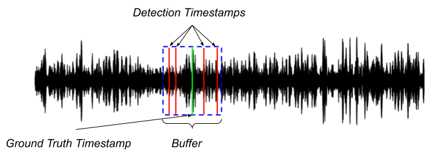
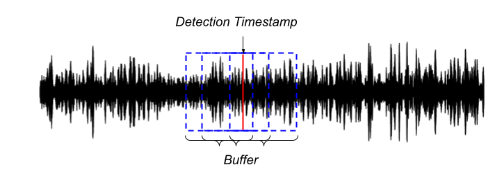

Benchmark for automatic detection of cetaceans using underwater acoustic recordings

# Task 1b - Detecting Antarctic baleen whale sounds across multiple geographical areas around Antarctica

## Introduction

The goal of this task is to produce a model that is able to detect Antarctic baleen whale sounds across multiple geographical areas around Antarctica. The datasets used are proposed by Miller et al (2022) [1], a collection of 11 open-access datasets for developing automated detectors. This dataset has been chosen as it is the largest open access dataset, with multiple species manually annotated over a large geographical area and temporal period. 
More information can be found on the original paper [1]


 [1] Miller, B.S., The IWC-SORP/SOOS Acoustic Trends Working Group, Miller, B.S., Stafford, K.M., Van Opzeeland, I., Harris, D., Samaran, F., Širović, A., Buchan, S., Findlay, K., Balcazar, N., Nieukirk, S., Leroy, E.C., Aulich, M., Shabangu, F.W., Dziak, R.P., Lee, W.S., Hong, J.K., 2021. An open access dataset for developing automated detectors of Antarctic baleen whale sounds and performance evaluation of two commonly used detectors. Sci Rep 11, 806. https://doi.org/10.1038/s41598-020-78995-8

This task emphasizes the importance of data preparation and training strategies to create models that can generalize well to different underwater environments.

## Task Description

### Objective
The objective is to train models on 10 out of the 11 datasets and assess their ability to generalize with the remaining unseen dataset by accurately detecting Antarctic baleen whale sounds.

### Data

**Table extract from [1]** : Description of annotated datasets including the site-year, location, initials of the analyst who made the annotations, type of instrument, start and stop date of the annotations, and number of hours (independent dates and times) annotated, as well as the total duration of the recordings annotated. 

![Table extract from [1]](imgs/dataset_infos.png)

Among the eleven datasets in the original publication, the dataset **Balleny Island 2015** was chosen for evaluation. This dataset represents a unique geographical location, the recording device used is only shared with one other dataset and finally, all seven labels are significatively present in it.

Seven labels have to be detected: 
- **BmA**: Antarctic blue whale unit A
- **BmB**: Antarctic blue whale unit AB
- **BmZ**: Antarctic blue whale z-call
- **BmD**: Blue whale FM (AKA D-calls)
- **Bp20Hz**: Fin whale 20 Hz pulse
- **Bp20Plus**: Fin whale 20 Hz pulse with energy at higher frequencies (e.g. 89 or 99 Hz components)
- **BpDS**: Fin whale FM calls (AKA ‘high frequency’ downsweep; AKA 40 Hz pulse). 

**Please, note that the proposition is a beta-test. We strongly believe that a cross validation over the 11 datasets should be done in future versions**

Both the training and evaluation data have been reorganized and are available in a single downloadable package: [Download dataset](https://drive.google.com/drive/folders/1sJov_w8VBNbEdmjJeYuIBS_10YIqVRql?usp=sharing)


### Model Requirements

Participants are free to employ any preprocessing technique and network architecture. The onyl requirement is that the final output of your model MUST be a CSV file formatted as follows:

| filename   | label | timestamp |
| ---------- | --------- | --------|
Where:
- `filename`: The name of the file where the detection occurred.
- `label`: Label type of the detected vocalization (BmA/BmB/BmZ/BmD/Bp20Hz/Bp20Plus/BpDS)
- `timestamp`: The detection time from the start of the file.

A 10-second buffer will be applied, where detections within this range from the annotation will be considered a true positive.

Please see the examples in this page for a more in depth discussion on how to provide the timestamps.

### Model Evaluation

Models will be evaluated based on Precision, Recall and F1 score average over each label. The test set includes 200 hours of recordings at 1KHz (but it can be downsampled at 250Hz as no target vocalization gets higher than 120Hz), with:
- 923 BmA 
- 44 BmB
- 31 BmZ
- 46 BmD
- 951 Bp20Hz
- 148 Bp20Plus
- 78 BpDS

#### Performance Metrics

The provided `evaluation.py` script will be used to compute metrics for each label.

A True Positive (TP) is recorded when a detection timestamp intersects with a ground truth buffer. A False Positive (FP) is incremented when a detection timestamp does not overlap with any ground truth buffer. Finally a False Negative (FN) is noted when there is a ground truth event that does not have a corresponding detection timestamp.

Note: The true positive count will only be incremented once per detection timestamp. For instance if multiple detection timestamps aligns with only one ground truth, the true positive count will be incremented only once. Similarly, if one detection timestamp aligns with multiple ground truths, the true positive count will be incremented for each ground truth.

The following images illustrates these scenarios:



In the image above, several detection timestamps are indicated by red lines, all of which fall within the same ground truth buffer marked by a green line and a blue box. Under this scenario, the count of true positives will be incremented only once, despite multiple detections.



In the image above, a single detection timestamp (red line) intersects with several ground truth buffers (blue boxes). In this case, the count of true positives will be incremented for each ground truth that the detection timestamp overlaps, despite there being "only one" detection.

Precision $P$, Recall $R$ and F1 score $F_1$ will be computed as:

$\begin{aligned}
P = \frac{TP}{TP + FP} \\
R = \frac{TP}{TP + FN} \\
F_1 = 2\frac{P\times R}{P + R} \\
\end{aligned}$

Note that those metrics will be averaged over all labels, but the score per label will also be computed and report. 

This task aims to challenge and assess the ability of models to adapt and perform in varying acoustic environments, reflecting the real-world variability encountered in marine mammal monitoring.

# Sample Code

We have prepared a sample code run a simple baseline and to provide general guidance for approaching the challenge. This approach is intended solely as a reference, and you are not required to follow any specific steps outlined in it, except for running the metrics file. Nonetheless, this serves as a useful guideline for participating in the challenge.


## Requirements

Python > 3.8

It is recommended to create a new python environment to run the code and install the dependencies.

Install the dependencies with:

```
pip install -r requirements.txt
```

The code was tested on torch version 1.10.1. But it should work with newer versions as well.

To run the code simply issue the commands in your CLI. Ensure you are in the correct working directory. Remember that if you are using a Windows operating system, you will need to replace the forward slashes (`/`) in the directory paths with backslashes (`\`).

## Outline

In this example, a simple 3-layer CNN has been trained to classify 15-second audio segments as either containing each one of the seven targeted labels. Below is a detailed outline of the process.


1. **Data Preprocessing**: Segments of 15 seconds with an offset of 2.5 seconds are checked for all datasets. If a segment contains more than 50% of an annotation, it is considered as positive for the given label. 
All positive segments and as many negative segments of ten datasets are extracted to constitute the development set. All segments of the dataset used for evaluation constitute the evaluation set, to imitate a realistic detection task in an unknown dataset.
2. **CNN Training**: The CNN is trained using the selected samples over a few epochs.
3. **Classifier Application**: The trained CNN is applied to the entirety of the test wave files using a sliding window approach. 
4. **Performance Measurement**: The detections are evaluated against the ground truth annotations for the test dataset. Precision, Recall and F1 score are first computed separately for each label and then averaged as the number of detected events for each label is imbalanced. 

Each stage of the process is encapsulated in its own Python script:
- `format_data.py` — For data preprocessing and database creation.
- `train_cnn.py` — For CNN training.
- `run_cnn.py` — For the application of the CNN classifier on test data.
- `evaluation.py` — For the calculation of performance metrics.

All fixed parameters such as spectrogram configuration or hyperparameters for the training specified in the `parameters.py` file. Each script contains comments and can be executed via the OS CLI, as outlined in the sections below. Participants are allowed to reuse and modify any part of the code for their needs (except the evaluation part).

## Creating the database

To create the database, we will use the `format_data.py` script. For this sample code, the training dataset is composed of segments extracted from 10 datasets, all except Balleny Island 2015. 

Firstly, all datasets are checked segment by segment: each segment has a duration of 15 seconds and the overlap between each segment is 12.5 seconds (offset of 2.5 seconds).
For each segment, if it contains at least 50% of an annotated vocalization, the corresponding label is considered positive. 
A resulting CSV file is saved (`ALLannotations.csv`), with one row per segment. Each row indicate: the path to the original audio file, the start and the end of the segment in seconds, and a boolean value for each label (positive or negative).   

Then, two CSV files are saved, containing selected samples for development and evaluation:
- `DEVannotations.csv`: Over the 10 datasets selected for development, all positive segments and as many negative segments are extracted to constitute the development set.
- `EVALannotations.csv`: All segment of the dataset used for evaluation (Balleny Island 2015) constitute the evaluation set, to imitate a realistic detection task in an unknown dataset.

Please, note that those 3 CSV file will be saved in a folder name `annot_merged` in the path to the directory where the data is stored. 

### Creating the Training and Evaluation Dataset

Run the following command to create the training database:

```shell
python format_data.py datasets_folder_path/
```

### Parameters Explained

- `datasets_folder_path/`: The directory where the data is stored (i.e. a folder 'datasets' containing all the folders for each dataset).


## Train a Model

Now, a simple 3-layer CNN will be trained to classify 15-second audio segments as either it contains each one of the seven targeted labels. Details on the implementation can be found in the train_cnn.py script.

To train the model, run the following command:

```shell
python train_cnn.py datasets_folder_path/ model_path/
```

### Parameters Explained

- `datasets_folder_path/`: The directory where the data is stored (i.e. a folder 'datasets' containing all the folders for each dataset).
- `model_path/`: The directory where the trained model will be saved.

## Run the Model

Next, we need to run the model trained in the previous step on the test data and save these detections in a CSV file.

Since our model operates on 15-second segments overlapped with 12.5 seconds, to comply with the challenge specification that the detection CSV file is formatted with a filename and timestamp, we must extract a timestamp. While different design decisions can be made here, we will use a simplistic approach: detections that exceed a given detection threshold for each label are recorded. As the offset constitutes a small portion of the segments' duration, we keep only the suite of at least 4 positive segments. The timestamp of the center of the suite is kept for the evaluation.

Other approaches can be taken, and participants are encouraged to use any method they see fit for their model.

For the purposes of this sample code, to run the model on a directory of audio files:

```shell
python run_cnn.py datasets_folder_path/ model_path/
```

### Parameters Explained

- `datasets_folder_path/`: The directory where the data is stored (i.e. a folder 'datasets' containing all the folders for each dataset).
- `model_path/`: The directory containing the trained model from the previous step.

## Evaluate on test data

Finally, please use the `evaluation.py` script to compute the final evaluation metrics of the detector on the test dataset. All participants will be evaluated in the same manner.

```shell
python metrics.py annotations_test.csv detections.csv
```

### Parameters Explained

- `annotations_test.csv`: The path to the test annotations file.
- `detections.csv`: The path to the CSV file containing the model's detections obtained in the previous step.
